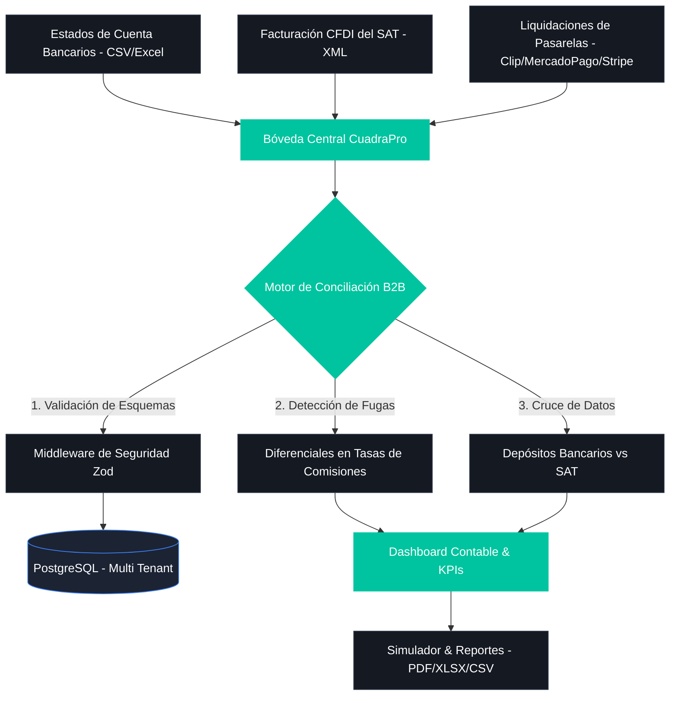

# CuadraPro — Bóveda de Conciliación Financiera B2B

<div align="center">
  
  <p><strong>Plataforma SaaS Multi-Tenant robustecida para el análisis y gestión de flujos de efectivo, deducciones y facturación corporativa.</strong></p>
  
  <p>
    <a href="#arquitectura-y-módulos-del-sistema"></a>
    <a href="#estructura-del-directorio"></a>
    <a href="#arquitectura-y-módulos-del-sistema"></a>
    <a href="#seguridad-y-criptografía"></a>
  </p>
  
  <br />
</div>

---

## Visión General

**CuadraPro** es una solución empresarial SaaS diseñada para resolver la conciliación bancaria, el cruce fiscal y la auditoría contable en negocios que operan con múltiples pasarelas de pago (Clip, Mercado Pago, Stripe) y cuentas bancarias. La plataforma opera como una **bóveda centralizada** donde se consolidan estados de cuenta bancarios, facturación electrónica CFDI del SAT e ingresos de procesadores de pago, detectando de forma automática discrepancias contables, comisiones no declaradas y fugas de capital.

El sistema está estructurado bajo una arquitectura **Multi-Tenant segura**, aislando estrictamente la información de cada empresa cliente y ofreciendo soporte completo para modo claro y modo oscuro.

---

## Diagrama de Funcionamiento

El siguiente diagrama detalla el flujo de ingesta de datos, las capas de validación criptográfica y los módulos de análisis generados:


```mermaid
flowchart TD
    classDef highlight fill:#00C49F,stroke:#00C49F,stroke-width:1px,color:#fff;
    classDef normal fill:#151922,stroke:#2d3748,stroke-width:1px,color:#fff;
    classDef database fill:#1c2333,stroke:#3b82f6,stroke-width:1px,color:#fff;

    A[Estados de Cuenta Bancarios - CSV/Excel]:::normal --> D[Bóveda Central CuadraPro]:::highlight
    B[Facturación CFDI del SAT - XML]:::normal --> D
    C[Liquidaciones de Pasarelas - Clip/MercadoPago/Stripe]:::normal --> D

    D --> E{Motor de Conciliación B2B}:::highlight
    E -->|1. Validación de Esquemas| F[Middleware de Seguridad Zod]:::normal
    E -->|2. Detección de Fugas| G[Diferenciales en Tasas de Comisiones]:::normal
    E -->|3. Cruce de Datos| H[Depósitos Bancarios vs SAT]:::normal

    F --> I[(PostgreSQL - Multi Tenant)]:::database
    G --> J[Dashboard Contable & KPIs]:::highlight
    H --> J
    J --> K[Simulador & Reportes - PDF/XLSX/CSV]:::normal
```

---

## Arquitectura y Módulos del Sistema

La plataforma integra los siguientes módulos funcionales:

### 1. Landing Page Institucional
*   **Hero Section Dinámico:** Página pública optimizada con tipografía Outfit y acentos de rotulador, barra de navegación superior sticky, botón de acceso directo y llamado a la acción con animaciones fluidas.
*   **Grilla de Aplicaciones:** Catálogo interactivo de 16 módulos funcionales que detallan las capacidades de la plataforma (Contabilidad, Descargas SAT, Firma SAT, Conciliación SPEI, Comisiones Clip, Mercado Pago, Inteligencia Artificial, Bóveda Segura, Registro de Horas, Auditoría Activa, Reportes Excel, Dashboard B2B, Doble Factor, Multiusuarios, CFDI 4.0 y Centro de Soporte).
*   **Redirección Inteligente:** Detección de sesiones activas en el navegador para canalizar al usuario directamente al panel principal.

### 2. Autenticación y Control de Accesos
*   **Google OAuth 2.0 Real:** Integración con Google Identity Services (GSI) con alcance de perfil y correo, sincronizando automáticamente el nombre completo y la foto de perfil oficial del usuario en el token JWT.
*   **Modo Simulación OAuth:** Entorno para pruebas locales y desarrollo continuo sin requerir credenciales externas inmediatas.
*   **Autenticación Tradicional:** Inicio de sesión con correo electrónico y contraseña cifrada con bcryptjs.
*   **Doble Factor de Autenticación (2FA / MFA):** Flujo de verificación con código OTP de 6 dígitos enviado por correo electrónico con ventana de validez temporal y protección contra reenvío masivo.
*   **Recuperación de Contraseñas:** Procedimiento seguro en dos pasos mediante códigos temporales de restablecimiento.
*   **Registro B2B:** Creación de cuentas corporativas con validación de complejidad de contraseña y asignación de roles.

### 3. Layout y Experiencia de Usuario
*   **Sidebar SaaS Flotante:** Menú lateral de navegación con transiciones suaves, indicador de ruta activa y restricciones visuales basadas en el rol del usuario (SuperAdmin vs. Administrador/Consultor).
*   **Avatar de Perfil con Fallback:** Despliegue de la fotografía de perfil de Google con cabecera libre de referrers o generación automática de iniciales de usuario en caso de ausencia de imagen.
*   **Selector de Tema Claro / Oscuro:** Interruptor con física de rebote mediante Framer Motion que almacena la preferencia en el navegador y actualiza toda la paleta de componentes.
*   **Monitoreo de Conectividad:** Banner reactivo que notifica al usuario en tiempo real ante caídas de red o desconexiones con el servidor API.
*   **Vigilancia de Inactividad:** Sistema de seguridad de sesión que despliega un modal de advertencia a los 90 segundos de inactividad con cuenta regresiva de 30 segundos previa al cierre automático.

### 4. Dashboard Contable y Métricas en Vivo
*   **Tarjetas KPI en Tiempo Real:** Indicadores conectados a la base de datos PostgreSQL: Balance Total, Fuga de Deducciones, Depositado en Banco y Facturado al SAT.
*   **Glosario Contextual:** Tooltips explicativos que traducen conceptos financieros a términos accesibles.
*   **Gráfico de Rendimiento Financiero:** Visualización compuesta interactiva con Recharts (Ingresos vs. Gastos) con degradados neón.
*   **Gráfico de Deducciones:** Gráfico de tipo dona que desglosa proporcionalmente retenciones fiscales e importes de pasarelas.
*   **Tabla de Auditoría:** Lotes de conciliación con buscador integrado, filtros por pasarela bancaria y paginación.
*   **Exportación de Reportes:** Generación inmediata de reportes multi-hoja en formato Excel (XLSX).

### 5. Directorio B2B y Multi-Tenant
*   **Gestión de Inquilinos:** Administración centralizada de empresas cliente con asignación de niveles de suscripción (Lite, Profesional, Enterprise).
*   **Segregación de Datos:** Aislamiento estricto de registros contables y transacciones por identificador de inquilino (`empresa_id`).

### 6. Captura y Conciliación
*   **Ingesta Drag & Drop Bancaria:** Carga de extractos de cuenta en formato CSV/Excel con prellenado automático de formularios.
*   **Parseo de Facturación SAT:** Lectura y procesamiento de archivos XML de facturas electrónicas vía FileReader del navegador.
*   **Arqueo de Caja Diario:** Formulario de registro de corte contable validado por esquemas Zod en el servidor.

### 7. Reportes y Auditoría Fiscal
*   **Cruce Contable-Fiscal:** Comparativa entre facturación emitida ante el SAT y volumen real depositado en cuentas bancarias.
*   **Catálogo de Exportaciones:** Descargas directas en formatos PDF, XLSX y CSV para auditorías mensuales, fugas de comisiones, retenciones y bitácoras de seguridad.

### 8. Comisiones y Simulador de Pagos
*   **Calculadora de Dispersión:** Simulación interactiva de costos por transacción para Clip Plus, Mercado Pago y Stripe Direct.
*   **Desglose Fiscal Completo:** Cálculo automático de comisión variable, cuota fija, IVA sobre comisión, retención del 1% del SAT y Neto Final a Recibir.
*   **Historial de Liquidaciones:** Registro detallado de transferencias con cuenta receptora e importes brutos y netos.

### 9. Centro de Control y Configuración
*   **Bóveda de Tasas:** Modificación de porcentajes base de comisión por pasarela y retención fiscal.
*   **Bitácora de Auditoría en Base de Datos:** Registro cronológico de acciones operativas, direcciones IP de origen y marcas de tiempo.
*   **Credenciales CIEC Cifradas:** Almacenamiento seguro de llaves fiscales protegidas con cifrado AES-256-GCM.

---

## Seguridad y Criptografía

*   **Protección de Cabeceras HTTP (Helmet):** Mitigación de vulnerabilidades de scripting cruzado (XSS), sniffing de MIME y Clickjacking.
*   **Validación de Esquemas con Zod:** Sanitización y validación estricta de cargas útiles antes de ejecutar consultas SQL.
*   **Cifrado Simétrico AES-256-GCM:** Encriptación de secretos en reposo con vectores de inicialización dinámicos y tags de autenticación.
*   **Tokens JWT de Sesión y Pre-Autenticación:** Tokens firmados con expiraciones configurables según preferencia de permanencia (8 horas o 7 días).
*   **Manejador Global de Excepciones:** Ocultación de stack traces y detalles internos del motor de base de datos en respuestas de producción.

---

## Sistema de Diseño y Paleta de Colores

*   **Verde Esmeralda Fintech (`#00C49F`):** Tono de acento principal para métricas positivas, saldos netos y elementos activos.
*   **Negro Profundo (`#0B0F19`):** Superficie de fondo general para el entorno en modo oscuro.
*   **Carbón de Contraste (`#151922`):** Fondo de tarjetas, tablas y contenedor lateral en modo oscuro.
*   **Gris Neutro Claro (`#f8f9fa`):** Fondo general del sistema en modo claro.
*   **Amarillo Resaltador (`#ffc043`):** Énfasis tipográfico en títulos y llamados visuales.
*   **Tipografía Primaria:** Outfit (Google Fonts) para encabezados, métricas numéricas y textos de interfaz.
*   **Tipografía Secundaria:** Caveat (Google Fonts) para anotaciones y detalles complementarios.

---

## Variables de Entorno

**Backend (`cuadrapro-backend/.env`):**
```env
PORT=3000
DATABASE_URL=postgresql://[usuario]:[password]@[host]:5432/[database]?sslmode=require
JWT_SECRET=tu_firma_secreta_super_segura
GOOGLE_CLIENT_ID=[id_cliente_google_console]
SMTP_HOST=smtp.ejemplo.com
SMTP_PORT=587
SMTP_USER=notificaciones@tuempresa.com
SMTP_PASS=tu_password_smtp
```

**Frontend (`cuadrapro-frontend/.env`):**
```env
VITE_API_URL=https://tu-backend.onrender.com
VITE_GOOGLE_CLIENT_ID=[id_cliente_google_console]
```

---

## Guía de Despliegue en Producción

### 1. Servidor Backend (Render.com / Railway / Servidor Node)
*   **Directorio Raíz:** `cuadrapro-backend`
*   **Comando de Compilación:** `npm install`
*   **Comando de Inicio:** `npm start`
*   **Conexión a Base de Datos:** Si la contraseña de PostgreSQL contiene caracteres reservados (como `%`), deben codificarse en percent-encoding en la variable `DATABASE_URL` (por ejemplo `%25` para `%`), o suministrarse mediante variables desglosadas (`DB_USER`, `DB_HOST`, `DB_NAME`, `DB_PASSWORD`, `DB_PORT`).

### 2. Cliente Frontend (Vercel / Netlify / Cloudflare Pages)
*   **Directorio Raíz:** `cuadrapro-frontend`
*   **Framework Preset:** `Vite`
*   **Comando de Compilación:** `npm run build`
*   **Directorio de Salida:** `dist`
*   **Recompilación Obligatoria:** Toda modificación en `VITE_API_URL` o `VITE_GOOGLE_CLIENT_ID` requiere ejecutar una nueva compilación de producción para inyectar los valores en los paquetes estáticos generados.

---

## Estructura del Directorio

```bash
CuadraPro/
├── assets/                               # Recursos gráficos y mockups oficiales
│   └── cuadrapro_mockup.jpg
│
├── screenshots/                          # Galería de capturas del sistema
│   ├── SCREENSHOTS.md                    # Documentación visual de módulos
│   ├── 00_logo.png
│   ├── 00_icon.png
│   ├── 01_landing_hero.png
│   ├── 02_login.png
│   ├── 03_dashboard_dark.png
│   ├── 04_captura_conciliacion.png
│   ├── 05_reportes_auditoria.png
│   ├── 06_comisiones_simulador.png
│   ├── 07_configuracion.png
│   └── 08_landing_apps_grid.png
│
├── cuadrapro-backend/                    # Servicio API REST (Node.js + Express)
│   ├── src/
│   │   ├── config/                       # Configuración de base de datos y logging
│   │   │   ├── db.js
│   │   │   └── logger.js
│   │   ├── controllers/                  # Controladores de lógica de negocio
│   │   │   ├── authController.js
│   │   │   ├── clientesController.js
│   │   │   ├── conciliacionController.js
│   │   │   └── soporteController.js
│   │   ├── middlewares/                  # Capas de autorización y validación
│   │   │   ├── authMiddleware.js
│   │   │   └── validateSchema.js
│   │   ├── routes/                       # Definición de rutas Express
│   │   │   ├── authRoutes.js
│   │   │   ├── clientesRoutes.js
│   │   │   ├── conciliacionRoutes.js
│   │   │   └── soporteRoutes.js
│   │   ├── services/                     # Servicios de auditoría y mensajería
│   │   │   ├── auditService.js
│   │   │   └── emailService.js
│   │   ├── utils/                        # Utilerías de cifrado criptográfico
│   │   │   └── cryptoHelper.js
│   │   └── index.js                      # Punto de entrada y servidor principal
│   ├── tests/                            # Pruebas automatizadas (Jest + Supertest)
│   │   ├── conciliacion.test.js
│   │   ├── googleAuth.test.js
│   │   └── mfaAuth.test.js
│   ├── package.json
│   └── .gitignore
│
├── cuadrapro-frontend/                   # Aplicación Web SPA (React + Vite + Tailwind)
│   ├── src/
│   │   ├── components/                   # Componentes reutilizables
│   │   │   ├── Layout.jsx
│   │   │   └── RutaProtegida.jsx
│   │   ├── pages/                        # Páginas y vistas principales
│   │   │   ├── Captura.jsx
│   │   │   ├── Clientes.jsx
│   │   │   ├── Configuracion.jsx
│   │   │   ├── Dashboard.jsx
│   │   │   ├── Landing.jsx
│   │   │   ├── Login.jsx
│   │   │   ├── NotFound.jsx
│   │   │   ├── Pagos.jsx
│   │   │   └── Reportes.jsx
│   │   ├── App.css
│   │   ├── App.jsx
│   │   ├── index.css
│   │   └── main.jsx
│   ├── tailwind.config.js                # Definición de paleta de colores y tokens
│   ├── vite.config.js
│   ├── package.json
│   └── .gitignore
│
├── README.md                             # Documentación técnica general
└── .gitignore                            # Exclusiones de control de versiones
```

---

<div align="center">
  <i>Construido con precisión contable, rigor de seguridad y refinamiento estético de nivel corporativo.</i>
</div>
