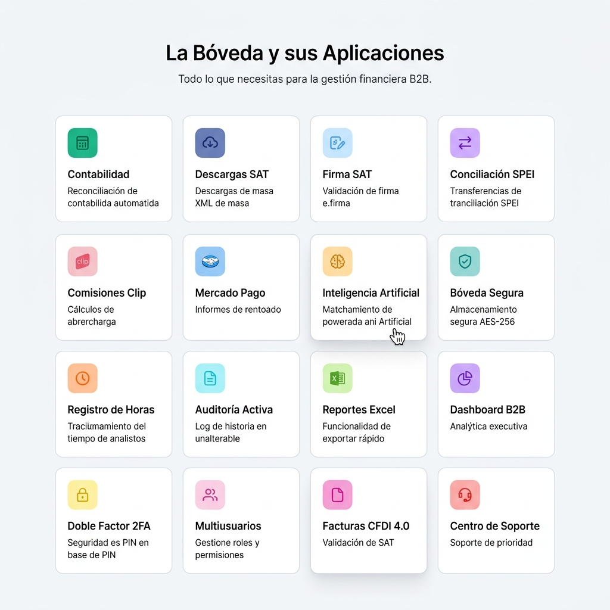
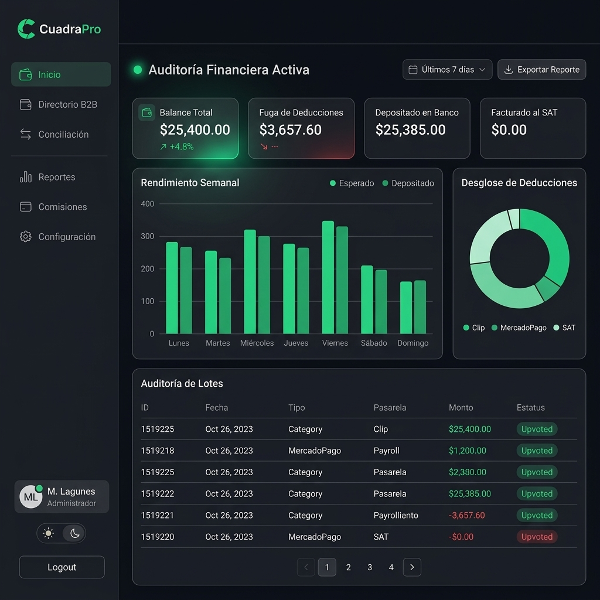
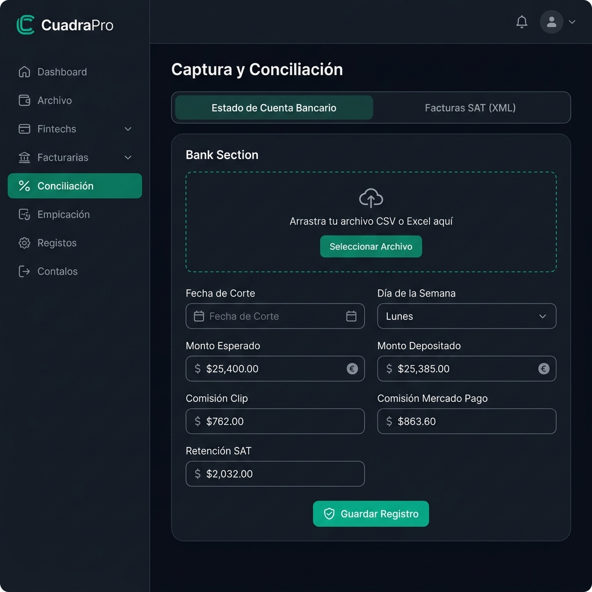
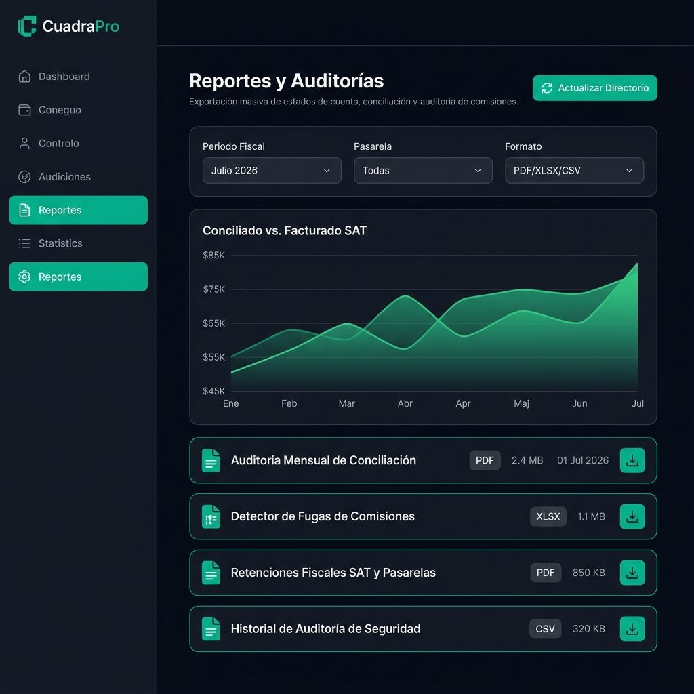
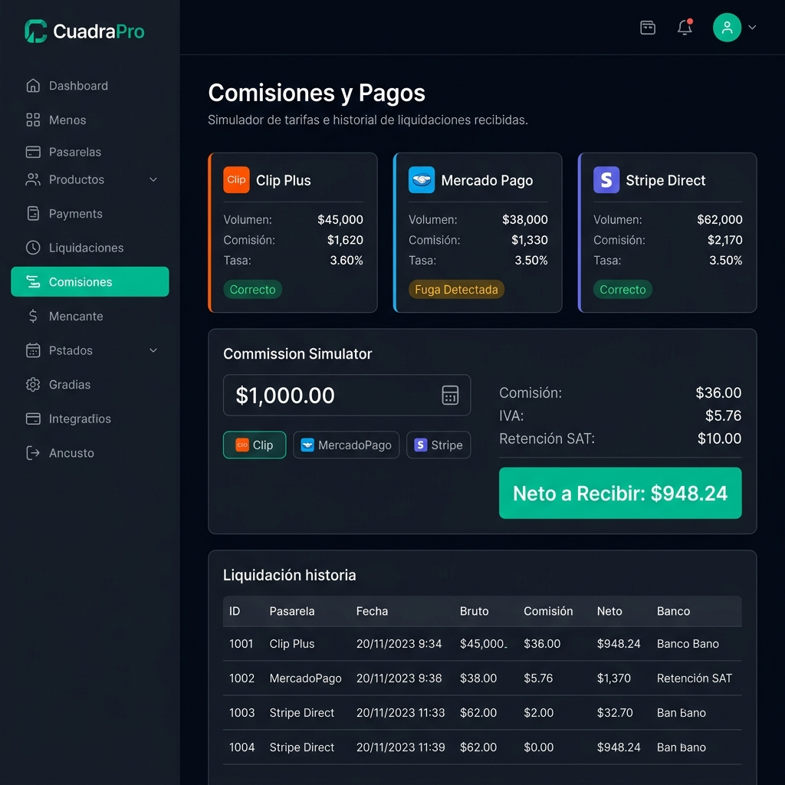
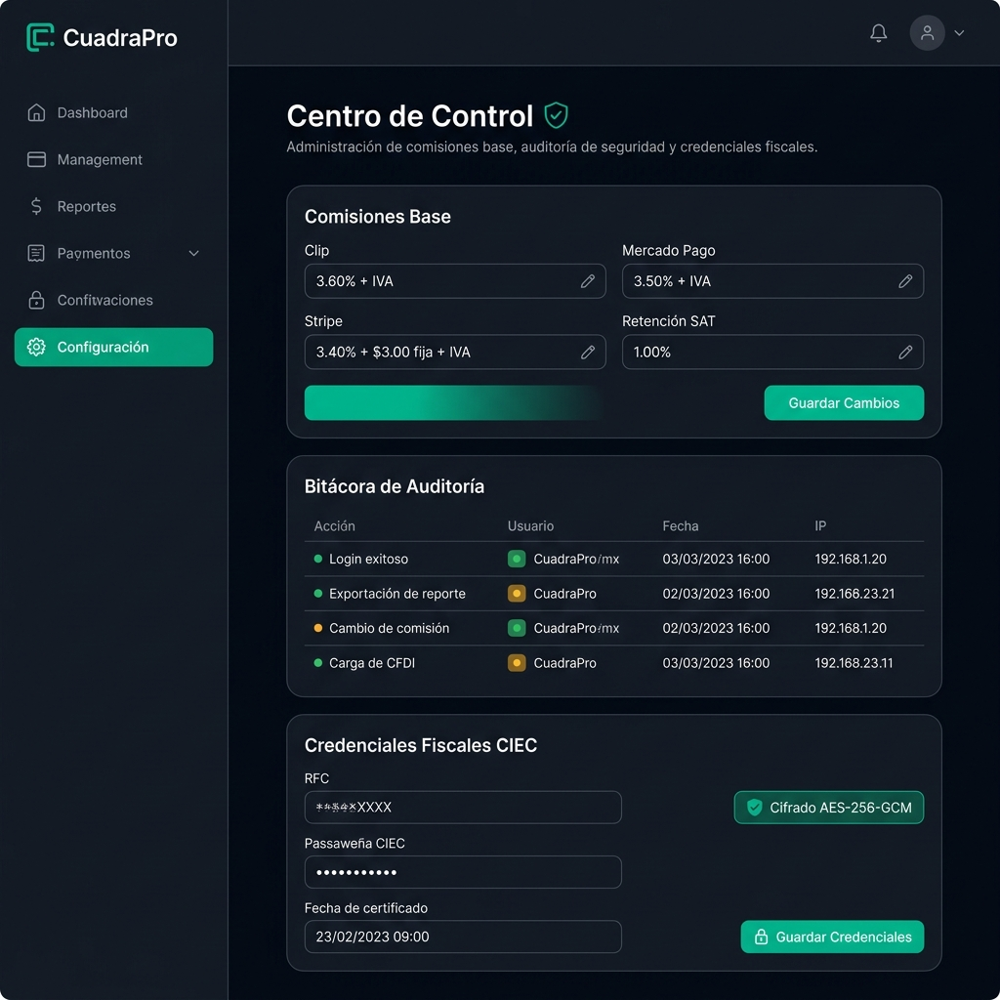

# CuadraPro — Galería de Screenshots del Sistema

  
  
<strong>Bóveda de Conciliación Financiera B2B — Capturas de Pantalla</strong>

  
<em>Plataforma SaaS Multi-Tenant para el análisis y gestión de flujos de efectivo, deducciones y facturación corporativa.</em>

---

## 📋 Índice de Pantallas

| # | Pantalla | Archivo | Descripción |
|---|----------|---------|-------------|
| 1 | Landing Page — Hero | `01_landing_hero.png` | Página de aterrizaje con hero section, CTA y navegación principal |
| 2 | Landing Page — Apps Grid | `08_landing_apps_grid.png` | Grilla de 16 módulos/aplicaciones tipo Odoo |
| 3 | Login / Acceso Seguro | `02_login.png` | Formulario de inicio de sesión con Google OAuth y 2FA |
| 4 | Dashboard Contable | `03_dashboard_dark.png` | Panel principal con KPIs, gráficos y tabla de auditoría |
| 5 | Captura y Conciliación | `04_captura_conciliacion.png` | Módulo de carga bancaria y facturas SAT (XML) |
| 6 | Reportes y Auditorías | `05_reportes_auditoria.png` | Centro de reportes con gráfico de conciliación fiscal |
| 7 | Comisiones y Simulador | `06_comisiones_simulador.png` | Simulador de comisiones Clip, MercadoPago y Stripe |
| 8 | Centro de Control | `07_configuracion.png` | Configuración de tasas, bitácora de auditoría y CIEC |

---

## 1. 🏠 Landing Page — Hero Section

> Página de aterrizaje pública con diseño limpio estilo Odoo. Tipografía **Outfit** + acentos manuscritos con fuente **Caveat**. Incluye navegación sticky, botones CTA con animaciones Framer Motion y badge de México.

**Componentes clave:**
- Header sticky con navegación y CTA "Pruébalo gratis"
- Título principal con resaltado amarillo tipo rotulador (`#ffc043`)
- Subtítulo con subrayado verde (`#00C49F`)
- Anotación manuscrita flotante con precio SaaS
- Badge de bandera mexicana vectorizada

---

## 2. 📱 Landing Page — Grilla de Aplicaciones

> Sección de 16 módulos tipo **Odoo** que muestran todas las capacidades de la plataforma. Cada tarjeta tiene icono con fondo semitransparente de color y descripción breve.

**Módulos incluidos:**
- Contabilidad, Descargas SAT, Firma SAT, Conciliación SPEI
- Comisiones Clip, Mercado Pago, Inteligencia Artificial, Bóveda Segura
- Registro de Horas, Auditoría Activa, Reportes Excel, Dashboard B2B
- Doble Factor (2FA), Multiusuarios, Facturas CFDI 4.0, Centro de Soporte

---

## 3. 🔐 Login / Acceso Seguro

> Pantalla de inicio de sesión con diseño Clean SaaS. Soporta login con email/contraseña, Google OAuth real, recuperación de contraseña con código OTP y registro de nuevas cuentas. Incluye flujo de 2FA (MFA).

**Funcionalidades:**
- Formulario de email + contraseña con toggle de visibilidad
- Botón de Google OAuth real (GSI Token Client)
- Checkbox "Recordar dispositivo"
- Flujo de recuperación de contraseña en 2 pasos
- Flujo de registro con confirmación de contraseña
- Verificación MFA con código de 6 dígitos y temporizador
- Botón "Volver" glassmorphic con backdrop blur

---

## 4. 📊 Dashboard Contable (Modo Oscuro)

> Panel principal de auditoría financiera con métricas en vivo conectadas a PostgreSQL. Incluye 4 KPIs, gráfico de barras semanal con Recharts, dona de deducciones y tabla de transacciones paginada.

**Componentes:**
- **4 Tarjetas KPI:** Balance Total, Fuga de Deducciones, Depositado en Banco, Facturado al SAT
- **Gráfico de Barras:** Rendimiento Semanal (Esperado vs. Depositado) con degradado neón
- **Gráfico de Dona:** Desglose de deducciones por pasarela (Clip, MercadoPago, SAT)
- **Tabla de Auditoría:** Lotes de conciliación con búsqueda, filtro por pasarela y paginación
- **Detector de Fugas:** Pestaña dedicada para alertas de discrepancias en comisiones
- **Exportar Reporte:** Generación multi-hoja Excel (XLSX) con resumen ejecutivo
- **Glosario interactivo:** Tooltips animados que explican cada métrica

---

## 5. 📤 Captura y Conciliación

> Módulo de ingreso de datos financieros con dos secciones: carga bancaria (CSV) y carga de facturas SAT (XML). Incluye drag & drop con simulación de parseo automático.

**Funcionalidades:**
- **Zona Drag & Drop bancaria:** Acepta archivos CSV/Excel y auto-rellena el formulario
- **Formulario de arqueo:** Fecha de corte, día, montos esperado/depositado, comisiones
- **Carga SAT:** Arrastre de archivos XML del SAT con lectura real via `FileReader`
- **Validación Zod:** Los datos se validan con esquemas estrictos antes de llegar a PostgreSQL

---

## 6. 📈 Reportes y Auditorías

> Centro de reportes con filtros avanzados, gráfico de área comparativo (Conciliado vs. Facturado SAT) y catálogo de reportes descargables en PDF, XLSX y CSV.

**Componentes:**
- **Filtros avanzados:** Periodo fiscal, pasarela y formato de exportación
- **Gráfico de Área:** Tendencia mensual con degradado verde
- **Catálogo de Reportes:** 4 tipos de reportes con tamaño, fecha y botón de descarga
  - Auditoría Mensual de Conciliación (PDF)
  - Detector de Fugas de Comisiones (XLSX)
  - Retenciones Fiscales SAT y Pasarelas (PDF)
  - Historial de Auditoría de Seguridad (CSV)

---

## 7. 💳 Comisiones y Simulador de Pagos

> Calculadora de dispersión de comisiones por pasarela con historial de liquidaciones. Permite simular el neto a recibir restando comisión, IVA y retención del SAT.

**Funcionalidades:**
- **3 Tarjetas de Pasarela:** Clip Plus, Mercado Pago y Stripe Direct con estado de fuga
- **Simulador Interactivo:** Input de monto + selección de pasarela = desglose instantáneo
  - Comisión variable (%), Cuota fija ($), IVA sobre comisión, Retención SAT (1%)
  - Resultado: **Neto a Recibir** resaltado en verde
- **Historial de Liquidaciones:** Tabla con ID, fecha, bruto, comisión, neto y banco receptor

---

## 8. ⚙️ Centro de Control (Configuración)

> Panel de administración con gestión de tasas base, bitácora de auditoría de seguridad y resguardo cifrado de credenciales fiscales CIEC con AES-256-GCM.

**Secciones:**
- **Comisiones Base:** Edición de tasas por pasarela con guardado instantáneo
- **Bitácora de Auditoría:** Log de seguridad con acciones, usuarios, fechas e IPs
- **Credenciales Fiscales CIEC:** RFC y contraseña cifrados con AES-256-GCM, badge de seguridad

---

## 🎨 Características Transversales del UI

| Característica | Detalle |
|----------------|---------|
| **Modo Oscuro/Claro** | Toggle con animaciones Framer Motion. Fondo `#0B0F19` / `#f8f9fa` |
| **Tipografía** | Google Fonts: Outfit (títulos), Caveat (anotaciones manuscritas) |
| **Color Acento** | Verde Esmeralda Fintech `#00C49F` |
| **Animaciones** | Framer Motion con spring physics en todas las transiciones |
| **Responsive** | Layout adaptativo mobile-first con Tailwind CSS |
| **Control de Inactividad** | Modal de countdown (30s) tras 90s de inactividad |
| **Sidebar** | Navegación flotante con usuario, rol e iniciales |
| **Toasts** | Sistema de notificaciones contextual (éxito/error) |

---

  Screenshots generados a partir del código fuente de CuadraPro — Julio 2026

